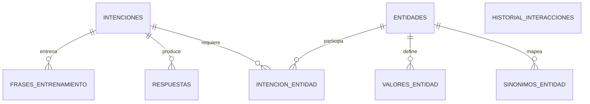

## Base de datos del Chatbot Casino: diseño, proceso y mejores prácticas para Dialogflow

### Objetivo y alcance

Este documento describe cómo se diseñó el modelo de datos que soporta el asistente (NLU) y la orquestación de respuestas, con foco en su integración con Dialogflow. Explica el proceso seguido para llegar a las tablas definidas en `database/init.sql`, las decisiones de modelado, y prácticas recomendadas para mantenerlo en producción.

### Principios de diseño (enfoque Dialogflow + arquitectura hexagonal)

- **Separación de preocupaciones**: Dialogflow detecta intenciones y entidades; la base de datos normaliza, decide y persiste el conocimiento y el historial.
- **Normalización semántica**: valores canónicos para entidades y tabla de sinónimos para reducir ambigüedad.
- **Respuestas condicionadas**: una misma intención puede tener respuestas diferentes según condiciones (p. ej., `ubicacion`).
- **Idempotencia y reproducibilidad**: `init.sql` recrea el estado base de la BD para entornos dev/demo.
- **Trazabilidad**: se persisten interacciones y decisiones (intención, entidades y respuesta) en `historial_interacciones`.
- **Internacionalización gradual**: columna `idioma` en `respuestas` para extender a múltiples idiomas.
- **Versionado**: columna `version` en `intenciones` para cambios controlados en definición/alcance.

### Proceso seguido para llegar al modelo

1) **Recolección de casos de uso** (dominio de casinos):
   - Abrir un casino, certificados, licencias, multas, obligaciones del titular, prevención de ludopatía, registro de prohibidos, requisitos de máquinas, ubicación permitida.

2) **Definición de Intenciones** (qué quiere el usuario):
   - Tabla `intenciones` contiene entradas como `abrir_casino`, `certificado_defensa_civil`, `licencias_casino`, `multas`, `obligaciones_titular`, `prevencion_ludopatia`, `registro_prohibidos`, `requisitos_maquinas`, `ubicacion_casino`.

3) **Identificación de Entidades** (variables del contexto):
   - Tabla `entidades`: `registro`, `regulacion`, `tipo_establecimiento`, `tipo_licencia`, `tipo_maquina`, `tipo_multa`, `ubicacion`.

4) **Valores canónicos y sinónimos**:
   - `valores_entidad` define el vocabulario canónico (p. ej., `Lima`, `Provincia`, `Hotel`, `Restaurante`, `Licencia municipal`, `Máquina tragamonedas`).
   - `sinonimos_entidad` mapea variantes de lenguaje a sus canónicos (p. ej., `Callao` → `Lima`; `Tragamonedas` → `Máquina tragamonedas`).

5) **Requisitos por intención**:
   - `intencion_entidad` indica qué entidades son requeridas para responder una intención y el `prompt` a usar si faltan (p. ej., `ubicacion` requerida para `ubicacion_casino` con el prompt: “¿Dónde está tu negocio, en Lima o provincia?”).

6) **Frases de entrenamiento**:
   - `frases_entrenamiento` está lista para almacenar datos de entrenamiento complementarios a Dialogflow (útil para auditoría o pipelines de mejora continua). Inicialmente vacía.

7) **Respuestas y condiciones**:
   - `respuestas` almacena textos por intención y `idioma`, con una `condicion` JSON opcional para elegir la respuesta más específica (p. ej., `{ "ubicacion": "Lima" }`).

8) **Historial de interacciones**:
   - `historial_interacciones` registra cada intercambio: intención detectada, entidades (en JSON) y la respuesta devuelta.

### Diagrama conceptual (ER)



### Modelo físico implementado (resumen por tabla)

- **`intenciones`**: catálogo de intenciones con `version` y `estado_activo`.
- **`entidades`**: catálogo de entidades del NLU.
- **`valores_entidad`**: valores canónicos por entidad.
- **`sinonimos_entidad`**: sinónimos → valor canónico por entidad.
- **`intencion_entidad`**: mapeo intención ↔ entidad, campo `requerida` y `prompt` de desambiguación.
- **`frases_entrenamiento`**: almacenamiento opcional/auxiliar de frases.
- **`respuestas`**: textos por `intencion_id`, `idioma` y `condicion` JSON.
- **`historial_interacciones`**: auditoría de interacciones (intención, entidades_detectadas, respuesta_devuelta).

### Buenas prácticas de integración con Dialogflow

- **Normalizar valores antes de decidir la respuesta**:
  - Convertir las capturas de Dialogflow a canónicos usando `sinonimos_entidad` y `valores_entidad`.
  - Ej.: si Dialogflow detecta `Callao`, normalizar a `Lima` antes de consultar `respuestas`.

- **Recolección de slots (slot filling) guiada**:
  - Consultar `intencion_entidad` para saber qué falta y con qué `prompt` preguntar.
  - No avanzar a respuesta hasta completar las entidades requeridas.

- **Selección determinista de respuesta**:
  - Preferir la respuesta con `condicion` más específica que cumpla el contexto (más claves JSON), y si no existe, usar la genérica (`condicion` NULL o `{}`).

- **Versionado y despliegue seguro**:
  - Mantener `version` de `intenciones` y duplicar filas de `respuestas` si cambia su semántica.
  - Evitar sobrescribir en caliente; usar migraciones que agregan sin borrar hasta estabilizar.

- **Internacionalización**:
  - Población paralela de `respuestas` por `idioma` (`es`, `en`, etc.).
  - Si no hay match exacto de idioma, fallback al idioma principal (ES).

- **Auditoría y mejora continua**:
  - Persistir cada interacción en `historial_interacciones` y analizar consultas sin match o prompts repetidos.

### Consultas de referencia (SQL)

- **Normalizar un sinónimo** (ej.: `Callao` → canónico de `ubicacion`):

```sql
SELECT ve.valor_canonico
FROM sinonimos_entidad se
JOIN valores_entidad ve
  ON ve.entidad_id = se.entidad_id
 AND ve.valor_canonico = se.valor_canonico
WHERE se.sinonimo = 'Callao'
  AND se.entidad_id = (
    SELECT entidad_id FROM entidades WHERE nombre = 'ubicacion' LIMIT 1
  );
```

- **Elegir respuesta por intención y contexto** (preferir condición más específica; ejemplo con `ubicacion = 'Lima'`):

```sql
SELECT r.*
FROM respuestas r
WHERE r.intencion_id = /* :intencion_id */ 9
  AND r.idioma = /* :idioma */ 'es'
  AND (
    r.condicion IS NULL
    OR JSON_EXTRACT(r.condicion, '$.ubicacion') = 'Lima'
  )
ORDER BY COALESCE(JSON_LENGTH(r.condicion), 0) DESC, r.respuesta_id
LIMIT 1;
```

- **Detectar entidades faltantes para una intención**:

```sql
SELECT e.nombre AS entidad, ie.requerida, ie.prompt
FROM intencion_entidad ie
JOIN entidades e ON e.entidad_id = ie.entidad_id
WHERE ie.intencion_id = /* :intencion_id */ 9
  AND ie.requerida = 1;
```

- **Auditar interacciones** (últimas N):

```sql
SELECT historial_id, fecha, intencion_detectada, entidades_detectadas, respuesta_devuelta
FROM historial_interacciones
ORDER BY historial_id DESC
LIMIT 100;
```

### Ejemplo de flujo end-to-end (resumen)

1) Dialogflow detecta `intencion = ubicacion_casino` y entidad `ubicacion = Callao`.
2) Backend normaliza `Callao` → `Lima` con `sinonimos_entidad`.
3) Consulta `intencion_entidad` para validar que `ubicacion` es requerida; como ya está, no pregunta.
4) Busca `respuestas` de la intención con `idioma = 'es'` y condición `{ "ubicacion": "Lima" }`. Si no existe, usa la genérica.
5) Guarda en `historial_interacciones` (intención, entidades normalizadas y respuesta elegida).

### Cómo extender el modelo (checklist)

- **Nueva intención**:
  1) Agregar en `intenciones` (incrementar `version` si es un cambio incompatible de otra existente).
  2) Definir requisitos en `intencion_entidad` (`requerida` y `prompt`).
  3) Cargar `respuestas` (por `idioma` y condiciones JSON necesarias).
  4) (Opcional) Añadir `frases_entrenamiento` para trazabilidad.

- **Nueva entidad**:
  1) Agregar en `entidades`.
  2) Poblar `valores_entidad` y `sinonimos_entidad`.
  3) Vincularla en `intencion_entidad` para las intenciones relevantes.

- **Nuevo valor/sinónimo**:
  - Insertar en `valores_entidad` y `sinonimos_entidad` manteniendo consistencia canónica.

### Contenido clave de `database/init.sql`

Fragmentos relevantes (DDL abreviado):

```sql
CREATE TABLE `intenciones` (
  `intencion_id` bigint unsigned NOT NULL AUTO_INCREMENT,
  `nombre` varchar(100) NOT NULL,
  `descripcion` text,
  `version` int DEFAULT '1',
  `estado_activo` tinyint(1) DEFAULT '1',
  PRIMARY KEY (`intencion_id`)
);
```

```sql
CREATE TABLE `entidades` (
  `entidad_id` bigint unsigned NOT NULL AUTO_INCREMENT,
  `nombre` varchar(100) NOT NULL,
  PRIMARY KEY (`entidad_id`)
);
```

```sql
CREATE TABLE `intencion_entidad` (
  `id` bigint unsigned NOT NULL AUTO_INCREMENT,
  `intencion_id` int DEFAULT NULL,
  `entidad_id` int DEFAULT NULL,
  `requerida` tinyint(1) DEFAULT '0',
  `prompt` text,
  PRIMARY KEY (`id`)
);
```

```sql
CREATE TABLE `respuestas` (
  `respuesta_id` bigint unsigned NOT NULL AUTO_INCREMENT,
  `intencion_id` int DEFAULT NULL,
  `respuesta_texto` text NOT NULL,
  `idioma` varchar(10) DEFAULT 'es',
  `condicion` json DEFAULT NULL,
  PRIMARY KEY (`respuesta_id`)
);
```

```sql
CREATE TABLE `historial_interacciones` (
  `historial_id` bigint unsigned NOT NULL AUTO_INCREMENT,
  `fecha` timestamp NULL DEFAULT CURRENT_TIMESTAMP,
  `intencion_detectada` varchar(100) DEFAULT NULL,
  `entidades_detectadas` json DEFAULT NULL,
  `respuesta_devuelta` text,
  PRIMARY KEY (`historial_id`)
);
```

### Notas operativas

- `CREATE DATABASE IF NOT EXISTS` y `DROP TABLE IF EXISTS` facilitan entornos limpios de desarrollo. En producción, preferir migraciones incrementales.
- Los datos de ejemplo cargados en `respuestas` e `intenciones` ilustran la estrategia de condicionamiento por `ubicacion` y el fallback genérico (`{}` o `NULL`).

### Conclusión

El modelo implementado permite:
- Normalizar entradas de Dialogflow mediante sinónimos y valores canónicos.
- Seleccionar respuestas condicionadas de forma determinista y auditable.
- Extender el asistente de manera segura (nuevas intenciones, entidades y variantes idiomáticas), manteniendo trazabilidad y buenas prácticas de NLU.


